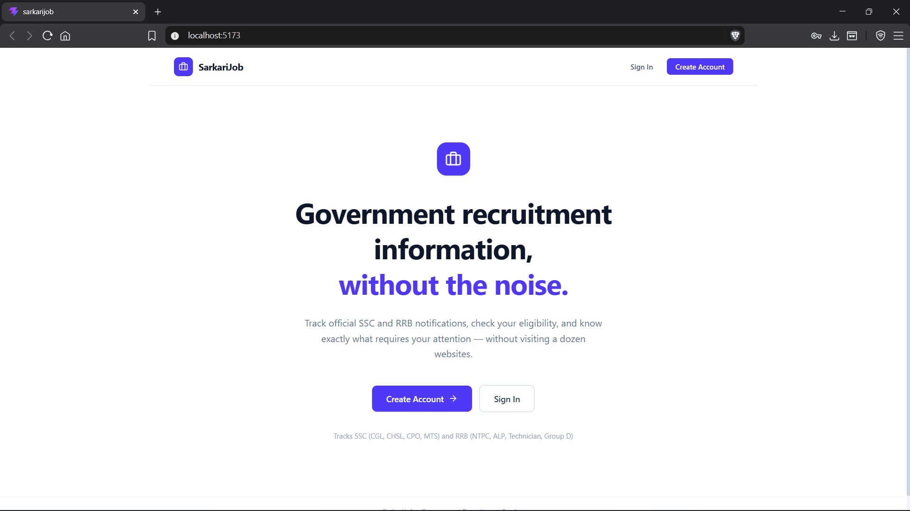
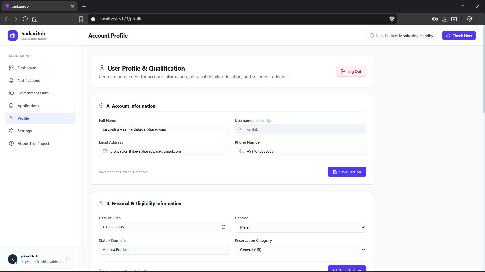

# 🇮🇳 SarkariJob — Government Recruitment Tracker

**One place to discover, track, and manage government job opportunities.**

SarkariJob is a full-stack web application designed to simplify the process of monitoring government recruitment notifications. It brings recruitment information from official **Staff Selection Commission (SSC), Andhra Pradesh Public Service Commission (APPSC), and Railway Recruitment Boards (RRB)** sources into a centralized dashboard.

The project focuses on reducing the effort involved in checking multiple recruitment websites, understanding eligibility requirements, tracking application deadlines, and keeping personal application records organized.

> **Disclaimer:** SarkariJob is an independent information and tracking project. It is not affiliated with or endorsed by any government organization. Always verify recruitment details on the relevant official website before applying.

---

## 📸 Screenshots

Explore the application's interface and features.

### 1. Dashboard

The central dashboard provides a summary of relevant recruitments, eligibility results, open opportunities, recent changes, and recruitment sources.


### 2. Landing Page

The public landing page introduces SarkariJob and its purpose before users sign in.



### 3. Recruitment Notifications

Browse recruitment updates collected from supported official sources and review available notification details.


### 4. Open Notifications

Review recruitment notifications and their current status, with links to official sources for further verification.


### 5. Application Tracking

Keep a personal record of recruitments you have applied for and opportunities you have decided not to pursue.


### 6. Profile and Eligibility

Maintain your education and qualification details to support recruitment eligibility assessments.



### 7. Official Government Links

Access the supported recruitment organizations and their official websites from one place.


### 8. About This Project

Learn why SarkariJob was created, how it is intended to help candidates, and who developed it.


---

## 🎯 Why SarkariJob?

Government recruitment information is often spread across multiple websites, notifications, PDFs, and recruitment portals. Candidates may need to repeatedly check these sources to find relevant opportunities and follow changing deadlines.

SarkariJob was created to make that process more organized.

The goals of the project are to:

- Centralize recruitment information from supported official sources.
- Reduce repetitive manual checking of recruitment websites.
- Help candidates compare recruitment requirements with their educational profiles.
- Highlight application windows and recent recruitment updates.
- Maintain a personal record of application decisions.
- Provide direct access to official notifications and application portals.

The intention is simple: **spend less time searching for opportunities and more time preparing for them.**

---

## ✨ Key Features

### 📊 Personalized Dashboard

- Summary of recruitments relevant to the candidate profile.
- Eligibility assessment overview.
- Open recruitment overview.
- Recent recruitment changes.
- Quick access to supported recruitment organizations.

### 🔔 Recruitment Notifications

- Centralized recruitment feed for supported sources.
- Organization-based filtering.
- Recruitment status and available dates.
- Links to official recruitment pages and documents.
- Support for reviewing recent changes to recruitment information.

### 🎓 Profile-Based Eligibility Assessment

- Store educational and qualification details.
- Compare available recruitment requirements with the saved profile.
- Classify assessments as:
  - **Eligible:** Known requirements appear to be satisfied.
  - **Needs Verification:** One or more requirements cannot be confidently determined.
  - **Not Eligible:** At least one known requirement does not match.
- Keep uncertain criteria visible instead of automatically treating unknown information as a pass.

Eligibility assessments are informational and must not replace the official recruitment notification or the recruiting authority's decision.

### 📝 Application Tracking

Maintain a personal application record using two manual decisions:

- **Eligible / Applied** — record a recruitment you have applied for.
- **Not Eligible / Not Applied** — record a recruitment you have decided not to pursue.

These decisions are independent of the automated eligibility assessment. Marking a recruitment as applied records the user's decision; it does not verify submission with a government portal.

### 🏛️ Official Government Links

Quick access to supported recruitment organizations:

- Staff Selection Commission (SSC)
- Andhra Pradesh Public Service Commission (APPSC)
- Railway Recruitment Boards (RRB)

Always use the official portal for the final application and verification process.

### 👤 User Profile and Authentication

- User registration and login.
- Authenticated access to personal application features.
- Profile and education management.
- Password hashing and token-based authentication.

### ⚙️ Automated Recruitment Monitoring

The backend includes a monitoring architecture designed to collect recruitment information, normalize records, detect changes, process available official documents, and refresh relevant eligibility matches.

Monitoring frequency is configurable through backend environment variables.

---

## 🏛️ Supported Recruitment Sources

| Organization | Coverage |
|---|---|
| SSC | Staff Selection Commission recruitment information |
| APPSC | Andhra Pradesh Public Service Commission notifications |
| RRB | Railway Recruitment Board recruitment information |

SarkariJob uses organization-specific collectors and a shared recruitment data model. A recruitment appearing in the database does not necessarily mean its application window is currently open.

Source accessibility and available information may vary. Historical records may be retained for tracking and reference.

---

## 🛠️ Technology Stack

### Frontend

- React 19
- TypeScript
- Vite
- Tailwind CSS
- React Router
- Axios
- Lucide React

### Backend

- Node.js
- Express.js
- TypeScript
- `tsx` for development
- JSON Web Tokens (JWT)
- `bcryptjs` for password hashing
- CORS and dotenv

### Database and Services

- Supabase / PostgreSQL
- Row Level Security (RLS)
- Gemini API for structured extraction of official recruitment document content
- PDF processing for recruitment notifications

### Deployment and Development

- Git and GitHub
- Vercel for frontend hosting
- Render for backend hosting
- Visual Studio Code

---

## 🏗️ High-Level Architecture

```text
                 ┌──────────────────────────┐
                 │      Official Sources    │
                 │       SSC / APPSC / RRB  │
                 └────────────┬─────────────┘
                              │
                              ▼
                 ┌──────────────────────────┐
                 │  Recruitment Collectors  │
                 │ Fetch and normalize data │
                 └────────────┬─────────────┘
                              │
                              ▼
                 ┌──────────────────────────┐
                 │   Document Processing    │
                 │  PDF text → Gemini JSON  │
                 └────────────┬─────────────┘
                              │
                              ▼
                 ┌──────────────────────────┐
                 │   Supabase / PostgreSQL  │
                 │ Recruitment and user data│
                 └────────────┬─────────────┘
                              │
                              ▼
                 ┌──────────────────────────┐
                 │     Express REST API     │
                 │ Auth, profile, tracking  │
                 └────────────┬─────────────┘
                              │
                              ▼
                 ┌──────────────────────────┐
                 │    React + TypeScript    │
                 │ Dashboard and UI         │
                 └──────────────────────────┘
```

The diagram represents the application's intended data flow. Individual source collectors and document-processing capabilities may have different levels of coverage depending on the source.

---

## 🗂️ Project Structure

The repository contains the frontend application and a separate backend service.

```text
sarkarijob/
├── screenshots/
│   ├── about us.png
│   ├── applied page.png
│   ├── govt links page.png
│   ├── landing.png
│   ├── notifications page.png
│   ├── open notifications.png
│   ├── profile.png
│   └── user dashboard.png
│
├── src/
│   ├── components/
│   │   ├── common/
│   │   └── layout/
│   ├── context/
│   ├── data/
│   ├── lib/
│   ├── pages/
│   ├── types/
│   ├── utils/
│   ├── App.tsx
│   ├── App.css
│   ├── index.css
│   └── main.tsx
│
├── backend/
│   ├── src/
│   │   ├── controllers/
│   │   ├── routes/
│   │   ├── services/
│   │   └── server.ts
│   ├── schema.sql
│   └── package.json
│
├── index.html
├── package.json
├── tsconfig.json
├── vite.config.ts
└── README.md
```

*Note: The structure above is a high-level overview. Individual files and directories may differ as development continues.*

---

## 🚀 Getting Started

Follow these instructions to run SarkariJob locally.

### Prerequisites

Install the following:

- Node.js and npm
- Git
- A Supabase project
- A Gemini API key if using AI-based document extraction

### 1. Clone the repository

```bash
git clone https://github.com/Karthik564125/sarkarijob.git
cd sarkarijob
```

### 2. Install frontend dependencies

From the project root:

```bash
npm install
```

### 3. Configure the frontend

Create a `.env` file in the project root if your frontend configuration requires one.

For example, if the frontend uses a configurable API base URL:

```env
VITE_API_BASE_URL=http://localhost:5000/api
```

Use the actual environment variable name expected by the existing frontend API client.

**Never place Supabase service-role keys, JWT secrets, or private API credentials in frontend environment variables.** Variables prefixed with `VITE_` can be exposed to browser code.

### 4. Install backend dependencies

```bash
cd backend
npm install
```

### 5. Configure backend environment variables

Create `backend/.env` using the variable names expected by the backend implementation.

Typical configuration includes:

```env
PORT=5000
SUPABASE_URL=your_supabase_project_url
SUPABASE_SERVICE_ROLE_KEY=your_supabase_service_role_key
JWT_SECRET=your_strong_random_jwt_secret
GEMINI_API_KEY=your_gemini_api_key
GEMINI_MODEL=your_configured_gemini_model
GEMINI_FALLBACK_MODEL=your_configured_fallback_model
CLIENT_ORIGIN=http://localhost:5173
RECRUITMENT_MONITOR_ENABLED=false
RECRUITMENT_MONITOR_INTERVAL_MINUTES=360
```

Replace the example values with your own credentials and the exact model names supported by your implementation.

The monitoring flag is set to `false` in this example to avoid automatically starting scheduled collection during initial setup. Enable it only after confirming the configuration and source collectors.

Do not commit `.env` files or expose secrets in screenshots, logs, issues, or documentation.

### 6. Set up the database

Use the database schema and migrations supplied with the project.

Apply the relevant SQL to your Supabase project and confirm that the required tables, indexes, triggers, and security policies exist.

Do not run destructive SQL against a database containing existing application data without reviewing its effects first.

### 7. Start the backend

From the `backend` directory:

```bash
npm run dev
```

The backend is configured to run on port `5000` in the local development setup.

If available, verify the health endpoint:

```text
http://localhost:5000/api/health
```

### 8. Start the frontend

Open a second terminal at the repository root:

```bash
npm run dev
```

Open the local URL printed by Vite, commonly:

```text
http://localhost:5173
```

If that port is already occupied, Vite may select another port. Ensure the backend CORS configuration allows the frontend's actual origin.

---

## 🔐 Security Considerations

SarkariJob handles user accounts and personal education/application records, so security is important.

- Keep all private credentials on the backend.
- Never commit `.env` files.
- Use strong JWT secrets.
- Hash passwords before storing them.
- Authenticate protected API requests.
- Derive the current user ID from the verified authentication token rather than trusting a user ID supplied by the client.
- Apply appropriate database access policies.
- Validate external document content before using extracted information.
- Do not treat AI-extracted recruitment details as authoritative without checking the official source.

---

## ⚠️ Limitations and Important Notes

- Recruitment sources may change their website structure, URLs, or publishing methods.
- Some official websites may be temporarily inaccessible or restrict automated requests.
- Recruitment dates, vacancies, eligibility criteria, and status can change through corrigenda or revised notifications.
- Automated document extraction can be incomplete or inaccurate.
- An eligibility result of **Needs Verification** means the available information is insufficient for a confident decision.
- A manually recorded application is not proof that a government application was submitted successfully.
- SarkariJob does not submit recruitment applications on behalf of users.
- Users must verify the latest notification, eligibility requirements, deadlines, fees, and application instructions on the official portal.

**Always rely on the official recruitment notification and portal for final decisions.**

---

## 🗺️ Future Improvements

Potential improvements for future versions include:

- More resilient official-source monitoring.
- Better detection of corrigenda and deadline extensions.
- Improved recruitment document extraction and validation.
- More detailed eligibility explanations.
- Better visibility into source freshness and collection failures.
- Additional recruitment boards and public-service commissions.
- Optional reminders for important application deadlines.
- Expanded automated testing and monitoring.

These are possible future enhancements and should not be interpreted as features already available.

---

## 👨‍💻 Author

**Karthik**

Full-Stack Developer | React | TypeScript | Node.js

I built SarkariJob to explore how full-stack development, database design, automated data collection, and AI-assisted document processing can solve a practical problem for government-job aspirants.

🌐 **Portfolio:** [karthik-portfolio-blond.vercel.app](https://karthik-portfolio-blond.vercel.app/)
🐙 **GitHub:** [Karthik564125](https://github.com/Karthik564125)
🚀 **Live Demo:** [SarkariJob](https://sarkarijob-psi.vercel.app/)

---

## 📄 License

Unless a license file is included in this repository, all rights are reserved by the project author. Contact the author before redistributing or reusing the project beyond applicable legal exceptions.

---

**Built with purpose. Built to make the government-job search more organized.**

If SarkariJob helps you organize your preparation, use it alongside the official recruitment websites—not as a replacement for them.
